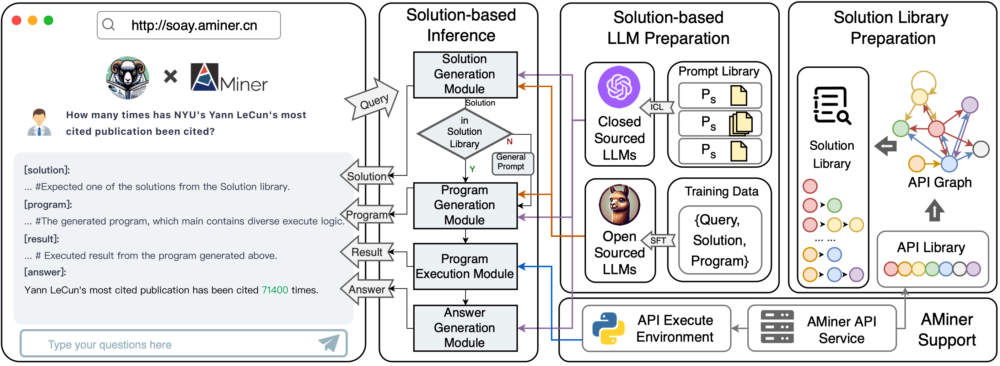

# SoAy: A Solution-based LLM API-using Methodology for Academic Information Seeking
> by WangYC
## ‼️ New: Training code of SoAyLLaMA updated ‼️ 
Find more at /SoAyLLaMA_Training
## ‼️ Important: SoAyBench v1.2 Updated ‼️
We fixed some QA issues and released SoAyBench v1.2.
```
./soayBench/soayBench_v1-2/
```
Google Drive: https://drive.google.com/file/d/1gZ5YfUAN5qUWYiQsF7IvXPcIbEih91Po/view?usp=sharing
Baidu Netdisk: https://pan.baidu.com/s/1lLcl68eAcVFdrFk-3Ytzxw?pwd=2a9v 
## SoAy x AMiner
http://soay.aminer.cn
## Paper
under review

## Introduction
SoAy is a cool framework designed to help Large Language Models (LLMs) learn to use SoAPI. It's been put into action on AMiner, allowing these models to tap into 7 different APIs provided by AMiner for tackling academic Q&A tasks. For instance, it can handle tricky questions like "How many times has the most cited paper by Yann LeCun at New York University been cited?" . This system is up and running and you can check it out at http://soay.aminer.cn.



## Usage
To try soay on your own device, you just need to clone this repo and follow the instructions below.

### AMiner API Checking
You can apply SoAy's methods to your own data systems and API systems. Here, we take AMiner as an example to illustrate how to use it.
Before we dive in, let's make sure you can smoothly access the API services of OpenAI and AMiner:
```
python api_test.py ----gpt_version gpt-4 --openai_key sk-xxxx
```
where you can pick the GPT version you want to use. We really recommend going for GPT-4 because, as our paper shows, it's way better for this kind of stuff than the older versions. 
Oh, and don't forget to pop in your OpenAI API key too.
Go on if you see the outputs like:
```
chatgpt is working
aminer_searchPersonComp is working
aminer_searchPublication is working
aminer_getPublication is working
aminer_getPersonBasicInfo is working
aminer_getPersonInterest is working
aminer_getPersonPubs is working
```
If you have any troubles here, feel free to drop the authors emails or just open an issue.

### Question Generation
SoAy provides a method for analyzing a set of APIs for a given system and is able to generate questions based on this method.

* Based on the input and output relationships of these APIs, an invocation relationship graph, also known as the API Graph, is constructed. 
* Sampling is performed on the API Graph with APIs that can accept user input as the starting nodes, obtaining all possible combinations of APIs within n hops. 
* According to the given API combination and the Cartesian product of the input of the first API and the output of the last API in this combination, the intent implied by this API combination, or the questions that can be answered, are enumerated. 

Generating questions for a given set of APIs not only facilitates the creation of benchmarks for this set of APIs and its underlying knowledge base, but also facilitates the collection of training data to train dedicated models for this data system.

Initially, you should build a config file like /config/function_config.jsonl to describe your APIs to SoAy.
```
cd solutionLibrary_toolkit
python api_graph.py
``` 
After you doing this, you'll find **graph.html** and **combinations.jsonl** in your repository, which demostrates how the APIs are connected and all combinations the API system support.

### Inference
```
python main.py --openai_key sk-xxxx
```
Of course, if you want to try other versions of GPT:
```
python main.py --gpt_version gpt-3.5-turbo --openai_key sk-xxxx
```
If you want to try other models, just add your model in model.py and revise relevant codes in main.py.
For getting responses of the models on SoAyBench:
```
python main.py --mode experiment --gpt_version gpt-3.5-turbo --openai_key sk-xxxx
```

## SoAyBench

SoAyBench is a benchmark with quantities of high-quality academic QA dataset and a cloned SoAPI service of AMiner.

You can download the dataset and the API descriptions at

Google Drive: https://drive.google.com/file/d/16mnO7y9ipJOMpxyHk7O9-3UymoGgecZ_/view?usp=sharing

Baidu Netdisk: https://pan.baidu.com/s/1IJIwJKk1dE7YSpoEKEeNfQ?pwd=61yv

We've based SoAyBench creation on AMiner. To really understand how well LLMs can use SoAPI, we need to make AMiner's basic SoAPIs available for LLMs to use. We also need a test set made up of academic (question, solution, answer) triplets for checking how they're doing. The tricky part is, academic data keeps changing fast – stuff like info on scholars and their publications. So, keeping a test set with fixed answers is tough.

To tackle this, what we've done is clone AMiner's SoAPIs as they were at a certain moment (Sep 15th 2023). This way, we've got a static version of the service. From there, we create a matching test set that doesn't change.

You can find all the details in SoAy/soayBench .

## Online Evaluation
To check out how SoAy rocks in the real online world, we went hands-on with some evaluations. We snagged 54 questions from real-deal users. Then, we rated the answers from GPT, our human labelers, and SoAy for both how spot-on they were and how easy they were to read (with readability mainly being about whether the responses matched the users' language style). After that, we dove into some nitty-gritty analysis of all the scores we got, all the codes of which can be found at SoAy/online_human_evaluation.


## Citation
If you find our code, dataset, or benchmark useful, please cite:
```
Citation
@inproceedings{
anonymous2024a,
title={A Solution-based {LLM} {API}-using Methodology for Academic Information Seeking},
author={Anonymous},
booktitle={Submitted to ACL Rolling Review - April 2024},
year={2024},
url={https://openreview.net/forum?id=hmBo6uPeZU},
note={under review}
}
```
